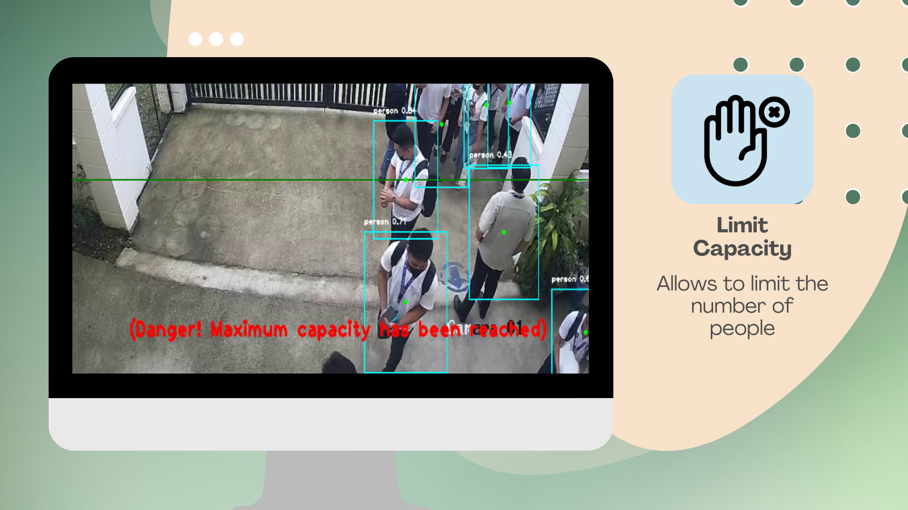

# Crowd Monitoring System

This study intends to monitor the individuals using CNN (Convolutional Neural Network) algorithm which functions as a neural network with one or more convolutional layers that is mostly used for processing images, classifying data, segmenting data, and other autocorrelated data.
## Overview
To train the custom dataset and utilize camera-based people and crowd detection, this application uses [YOLO Algorithm](https://www.section.io/engineering-education/introduction-to-yolo-algorithm-for-object-detection/). This app operates in real-time.

## Compatibility
* Windows 10 or 11

## Features
### 1. Detect Crowd

### 2. Limit Capacity

### 3. Count People

## Demo Video
To watch demo, click the link -> [https://youtu.be/Zx6D_zhU-Io](https://youtu.be/Zx6D_zhU-Io)

## Developer:
* Kyle G. Coronel
## Researcher:
* Asmila A. Alden
* Melanie Belandres
* Manel Honey Mae V. Facto
* Clarize P. Rosales

## Adviser:
* Jefferson A. Costales

## School Name:
Eulogio "Amang" Rodriguez Insitute of Science and Technology

Nagtahan, Sampaloc, Manila, Philippines

College of Arts and Sciences

ITE Department

## Course:
* Bachelor of Science in Computer Science

## Date:
* February 19, 2023

